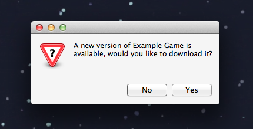
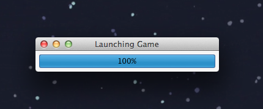

IndieLauncher
=============

IndieLauncher is a customisable, unobtrusive Launcher application that you can use to transparently provide automatic updates for your Indie Game. Updates are published by editing an RSS file on your website, and are automatically detected by the launcher when users try to run your game.

There's no system tray apps, background processes or login screens, just an small program that checks for updates to your game, downloads them, then launches your game and gets out of the way.

Screenshots
===========

Creating a Launcher for your game
=================================

The code in this repository provides a launcher that downloads the example game hosted [here](https://github.com/dan200/IndieLauncherExampleGame). To customise it into a launcher that will update and launch *your* game, you'll need to make some small changes:

1. Take a look at the [Example Game RSS file](https://github.com/dan200/IndieLauncherExampleGame/blob/master/ExampleGame.xml), customise it with the download links for your game, and host it somewhere online. Each entry in the RSS file represents a version of the game, and newer versions go at the top.

2. Download this repository, and take a look at [IndieLauncher/EmbeddedGame.txt](https://github.com/dan200/IndieLauncher/blob/master/IndieLauncher/EmbeddedGame.txt). Change the "game" field to the channel title from your RSS feed, and the "url" feed to where you have your RSS file hosted.

3. Optionally, you can embed a version of the game within the launcher itself, so that users without an active internet connection will always have something to play when they first run your launcher. Overwite [IndieLauncher/EmbeddedGame.zip](https://github.com/dan200/IndieLauncher/blob/master/IndieLauncher/EmbeddedGame.zip) with this file, and set the "version" field in EmbeddedGame.txt with the version of the game it represents. If you skip this step, remove this line and delete EmbeddedGame.zip.

4. Customise the Assembly Name and Icon to whatever you want your users to see, and build the soluton. The resultant .exe is standalone, and will update and run your game when it gets launched. Distribute it to your players however you like, and they'll always be up-to-date when you publish new versions of your game!

Securing your Launcher
======================

If your game is free, or you don't mind people who pirate your game getting automatic updates, your work here is done. Otherwise, you can use HTTP Authentication to ensure that only users who have a valid username and/or password can download updates to your game:

1. Configure your web server to return HTTP 401 Unauthorized for file downloads without a valid username and password. This will cause the user to be prompted for these details. Most webhost frontends will have options to set this up automatically for simple username/password combinations, or you can implement your own checks. Take a look at [this example](https://github.com/dan200/IndieLauncherExampleGame/tree/master/SecureExample) for a best practice guide and an example implementation in PHP.

2. If the username or password is the same for all your users, you can customise the "username" or "password" fields in EmbeddedGame.txt to save your users some typing. This allows you to have a launcher guarded by a single password or username only.
